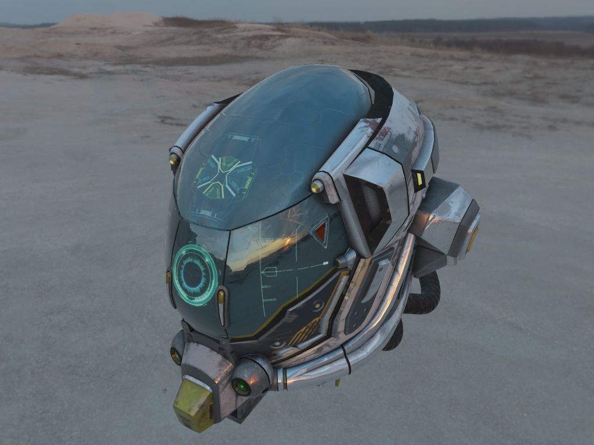

# gltf-viewer-rs

This project is a [glTF 2.0][0] viewer written in Rust. Rendering is done using the [Vulkan API][1]
using [Ash][2]. It runs on Window, Linux and MacOS.


## Features

- [x] Mesh vertices, normals, colors and two uv channels
- [x] Tangents generation
- [x] Material
  - [x] Base color factor and texture
  - [x] Metallic/Roughness factors and textures
  - [x] Emissive factor and texture
  - [x] Ambient occlusion
  - [x] Normal maps
  - [x] Alpha
    - [x] Opaque
    - [x] Mask
    - [x] Blend
  - [x] Double sided surfaces
- [x] IBL
- [x] Animations
  - [x] Node animation
  - [x] Skinning
  - [x] Interpolation
    - [x] Step
    - [x] Linear
    - [x] Cubicspline
- [ ] Extensions
  - [x] KHR_lights_punctual
  - [x] KHR_materials_unlit
  - [x] KHR_materials_pbrSpecularGlossiness
  - [ ] KHR_draco_mesh_compression
- [ ] Camera controls
  - [x] Orbital
  - [ ] First Person
- [x] Drag and drop
- [x] Background loading
- [ ] Post processing
  - [x] Gamma correction
  - [x] Tone mapping
  - [ ] Bloom
  - [ ] Ambient occlusion
  - [ ] Depth of field
- [x] Imgui integration
  - [x] Model description
  - [x] Animation controller
  - [x] Camera details
  - [x] Renderer settings

## Controls

- Left click and move to rotate camera around origin
- Right click and move to move camera
- Mouse wheel to un/zoom

## Build it

```sh
cargo build
```

By default, building the project will trigger shader compilation for all shaders in `./assets/shaders`.
You can either skip this step altogether by setting the environnement variable `SKIP_SHADER_COMPILATION`
to `true`, or you can change the default by setting `SHADERS_DIR`. Compiled shaders will be generated at
the same location as the shader source, with the same name suffixed by `.spv`.

> To compile the shaders you'll need to have `glslangValidator` on your PATH.

## Run it

Just type the following command and drag and drop and gltf/glb file in the window.

```sh
RUST_LOG=gltf_viewer_rs=warn cargo run
```

You can provide a yaml configuration file with `--config` (or `-c`). Check [this example file](./config.yml). And you can specify a file to load at startup
with `--file` (or `-f`)

```sh
RUST_LOG=gltf_viewer_rs=warn,vulkan=warn cargo run -- --config config.yml --file C:\\dev\\assets\\glTF-Sample-Models\\2.0\\Triangle\\glTF\\Triangle.gltf
```

### Validation layers

You can set up validation layers by running the following commands.

```sh
export VK_LAYER_PATH=$VULKAN_SDK/Bin
export VK_INSTANCE_LAYERS=VK_LAYER_KHRONOS_validation

# Then running the app with the --debug (-d) flag.
RUST_LOG=gltf_viewer_rs=warn cargo run -- --debug
```

## Known issues

On linux, enabling v-sync causes the system to freeze with some hardware configuration (tested on a laptop running Pop_os 19.04, with a GTX 1050Ti). It seems to be an issue related with PRIME sync.

## Credits

Most of the shader code for BRDF lookup and pre-filtered map generation come from the excellent [Sasha Willems' vulkan samples repository][3].

Cubemap faces have been generated using [matheowis' HDRi to cubemap tool][4].

HDRi textures have been downloaded from [hdriheaven][5].

[0]: https://github.com/KhronosGroup/glTF
[1]: https://www.khronos.org/vulkan/
[2]: https://github.com/MaikKlein/ash
[3]: https://github.com/SaschaWillems/Vulkan
[4]: https://github.com/matheowis/HDRI-to-CubeMap
[5]: https://hdrihaven.com/

## Screenshots


||||
|---|---|---|
||||
||||
